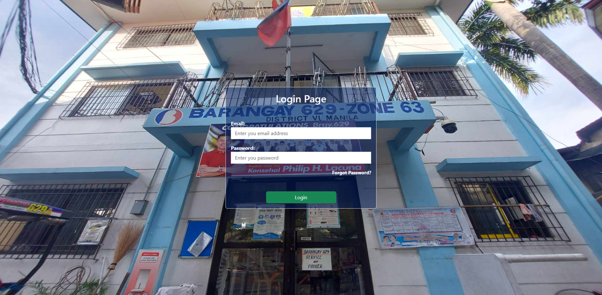
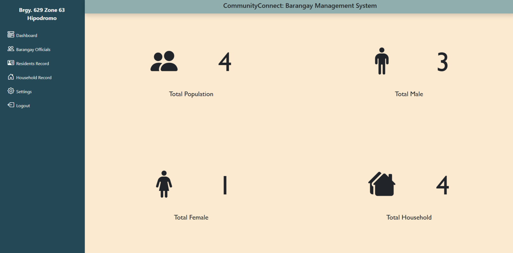

# Community Connect

A barangay management system that centralizes and simplifies the administration of resident information, households, and barangay records.

## Preview

<table>
  <tr>
    <td align="center"><b>Login</b></td>
    <td align="center"><b>Dashboard</b></td>
  </tr>
  <tr>
    <td></td>
    <td></td>
  </tr>
</table>